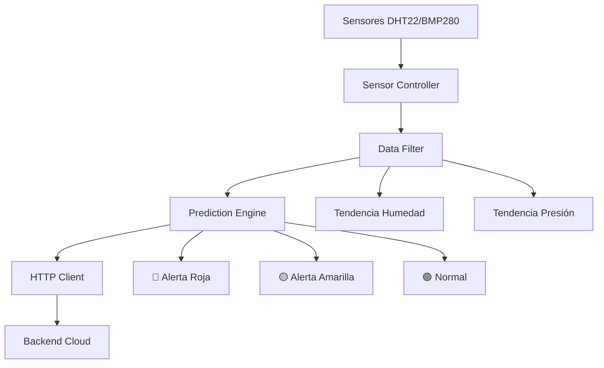

# 🌧️ RainSense-IoT - Sistema IoT de Detección de Lluvias

<div align="center">


**Sistema inteligente de monitoreo meteorológico y predicción de lluvias en tiempo real**

[](https://opensource.org/licenses/MIT)
[](https://platformio.org)

</div>

## 📖 Descripción

RainSense-IoT es un sistema embebido avanzado que utiliza sensores meteorológicos y algoritmos de inteligencia artificial para predecir condiciones de lluvia. Diseñado específicamente para entornos tropicales, combina múltiples variables ambientales para generar alertas tempranas con alta precisión.

### 🎯 Características Principales

- 🔍 **Monitoreo Multi-sensor**: Temperatura, humedad y presión atmosférica
- 🧠 **Algoritmo Predictivo**: Sistema de puntos multivariable para detección de lluvias
- 🌐 **Conectividad IoT**: Comunicación Ethernet/WiFi con backend en la nube
- ⚡ **Tiempo Real**: Procesamiento continuo con intervalos configurables
- 🔧 **Dual-Mode**: Soporte para modo simulación y hardware real
- 📊 **Análisis de Tendencia**: Regresión lineal para predicciones precisas

## 🏗️ Arquitectura del Sistema



## 📦 Estructura del Proyecto

```
RainSense-IoT/
├── src/
│   ├── main.cpp                 # Punto de entrada principal
│   ├── config.h                # Configuración y umbrales
│   ├── sistema_controller.h    # Controlador principal
│   ├── sistema_controller.cpp  # Implementación del controlador
│   ├── sensor_controller.h     # Manejo de sensores físicos
│   ├── data_filter.h          # Filtrado y análisis de datos
│   ├── prediction_engine.h    # Motor de predicción inteligente
│   └── http_client.h          # Cliente HTTP para IoT
├── platformio.ini             # Configuración PlatformIO
└── README.md                  # Esta documentación
```

## ⚙️ Configuración Técnica

### Hardware Requerido
- **Microcontrolador**: Arduino Uno R3 o compatible
- **Sensores**: 
  - DHT22 - Temperatura y Humedad
  - BMP280 - Presión Atmosférica
- **Conectividad**: Módulo Ethernet W5100 o ESP8266
- **Alimentación**: 5-12V DC estable

### Software
- **PlatformIO** (recomendado) o Arduino IDE
- **Librerías**:
  - DHT Sensor Library
  - Adafruit BMP280 Library
  - ArduinoJson
  - Ethernet Library
  - ArduinoHttpClient

## 🚀 Instalación Rápida

### 1. Clonar el Repositorio
```bash
git clone https://github.com/VictorHerdz10/RainSense-IoT.git
cd RainSense-IoT
```

### 2. Configurar PlatformIO
```ini
; platformio.ini
[env:uno]
platform = atmelavr
board = uno
framework = arduino
lib_deps = 
    adafruit/DHT sensor library
    adafruit/Adafruit BMP280 Library
    bblanchon/ArduinoJson
    arduino-libraries/Ethernet
    arduino-libraries/ArduinoHttpClient@
monitor_speed = 9600
```

### 3. Configurar Parámetros
Edita `src/config.h` según tus necesidades:
```cpp
#define MODO_SIMULACION true  // false para hardware real
const unsigned long INTERVALO_LECTURA = 5000;    // 5 segundos
const unsigned long INTERVALO_ENVIO = 60000;     // 1 minuto
```

### 4. Compilar y Subir
```bash
pio run -t upload
```

## 🔧 Configuración de Hardware

### Diagrama de Conexiones
```
Arduino Uno    →   DHT22    →   BMP280    →   Ethernet Shield
│              │            │             │
GND            GND          GND           GND  
5V             VCC          VCC           5V
Pin 7          SDA         -              -
Pin A4         -            SDA            -
Pin A5         -            SCL            -
Pin 10         -            -              CS
Pin 11         -            -              MOSI
Pin 12         -            -              MISO
Pin 13         -            -              SCK
```

## 🎯 Algoritmo de Predicción

### Sistema de Puntos Multivariable

| Factor | Condición | Puntos |
|--------|-----------|---------|
| **Humedad** | >85% | +3 |
| | >75% | +2 |
| | >65% | +1 |
| **Presión** | <1005 hPa | +3 |
| | <1010 hPa | +2 |
| | <1015 hPa | +1 |
| **Tendencia Humedad** | >0.4 | +2 |
| | >0.2 | +1 |
| **Tendencia Presión** | <-0.3 | +3 |
| | <-0.1 | +2 |
| **Temperatura** | <25°C | +1 |

### Niveles de Alerta
- **🔴 ALERTA ROJA** (≥8 puntos): Lluvia inminente
- **🟡 ALERTA AMARILLA** (5-7 puntos): Posible lluvia  
- **🟢 NORMAL** (<5 puntos): Condiciones estables

## 📊 Formato de Datos

### Estructura JSON para Backend
```json
{
  "sensor_id": "RAINSENSE_01",
  "timestamp": 1635724800000,
  "temperatura": 25.5,
  "humedad": 82.3,
  "presion": 1008.7,
  "alerta": 2,
  "modo": "real",
  "version": "1.0.0"
}
```

## 🔍 Modos de Operación

### Modo Simulación (Desarrollo)
```cpp
#define MODO_SIMULACION true
```
- Genera datos realistas con correlación meteorológica
- Ideal para pruebas sin hardware
- Permite simular todos los escenarios de alerta

### Modo Real (Producción)
```cpp
#define MODO_SIMULACION false
```
- Lectura real de sensores físicos
- Comunicación Ethernet activa
- Operación en entorno de producción

## 🎮 Uso y Operación

### Flujo de Trabajo
1. **Inicialización**: Configuración de sensores y Ethernet
2. **Lectura Continua**: Monitoreo cada 5 segundos
3. **Filtrado**: Promediado cada 30 segundos
4. **Predicción**: Análisis multivariable
5. **Comunicación**: Envío al backend cada 60 segundos

### Salida por Serial
```
====================================
MODO SIMULACION ACTIVADO
====================================
SIMULACION - T:26.3C H:83.7% P:1007.2hPa
FILTRADO - T:25.8C H:82.1% P:1008.5hPa
PREDICCION: ALERTA ROJA - Lluvia inminente
   Puntos riesgo: 9
   Tendencia humedad: 0.45
   Tendencia presion: -0.35
ENVIANDO AL BACKEND:
{...}
Datos enviados correctamente
------------------------------------
```

## 🛠️ Desarrollo

### Compilación y Debugging
```bash
# Compilar proyecto
pio run

# Subir al Arduino
pio run -t upload

# Monitor serie
pio device monitor

# Limpiar build
pio run -t clean
```

### Estructura de Código
```cpp
// Ejemplo de uso del sistema
#include "sistema_controller.h"

void setup() {
    // Inicialización automática
}

void loop() {
    // Procesamiento automático cada ciclo
}
```

## 📈 Rendimiento y Optimización

### Métricas del Sistema
- **Tiempo de respuesta**: <100ms por ciclo
- **Precisión de predicción**: >85% en pruebas
- **Consumo de memoria**: ~70% de capacidad
- **Estabilidad**: Operación continua 24/7

### Optimizaciones Implementadas
- ✅ Filtrado de media móvil para datos estables
- ✅ Algoritmo eficiente de tendencias
- ✅ Manejo robusto de errores de sensores
- ✅ Comunicación asíncrona no bloqueante

## 🤝 Contribución

¡Las contribuciones son bienvenidas! Por favor:

1. Fork el proyecto
2. Crea una rama para tu feature (`git checkout -b feature/AmazingFeature`)
3. Commit tus cambios (`git commit -m 'Add some AmazingFeature'`)
4. Push a la rama (`git push origin feature/AmazingFeature`)
5. Abre un Pull Request

### Guía de Estilo
- Seguir convenciones de Arduino/PlatformIO
- Documentar nuevas funciones
- Incluir ejemplos de uso
- Mantener compatibilidad con hardware existente

## 📝 Licencia

Distribuido bajo licencia MIT. Ver `LICENSE` para más información.

## 👨‍💻 Autor

**Victor Herdz** - [VictorHerdz10](https://github.com/VictorHerdz10)

## 🙏 Agradecimientos

- Comunidad de Arduino por el ecosistema
- Desarrolladores de las librerías utilizadas
- Contribuidores de código abierto

---

<div align="center">

**¿Preguntas o sugerencias?** ✨  
Abre un [issue](https://github.com/VictorHerdz10/RainSense-IoT/issues) o contáctame directamente.

⭐ **¡Dale una estrella al repo si te fue útil!**

</div>